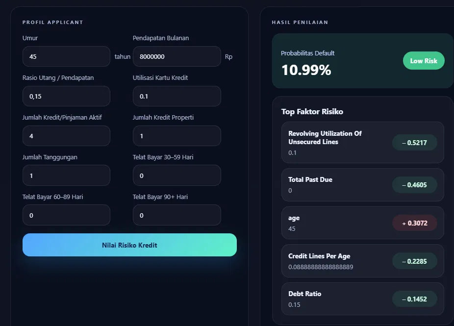
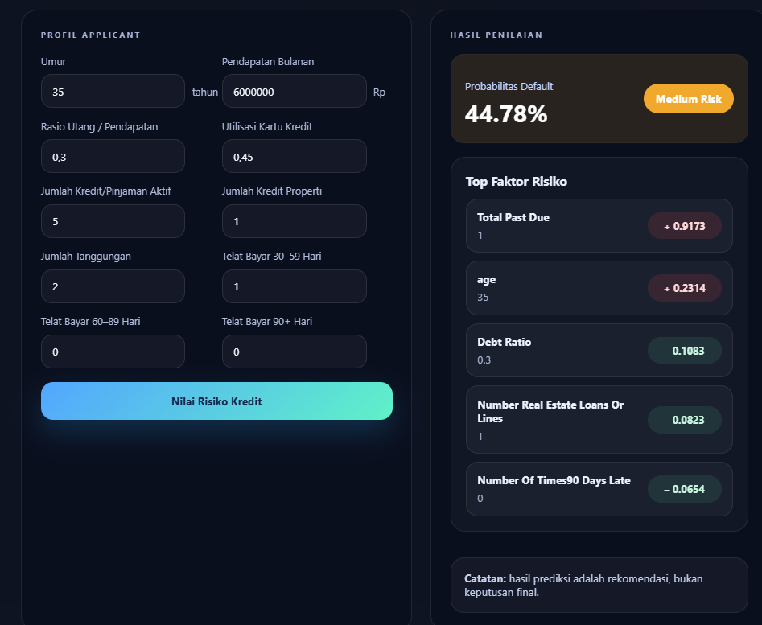
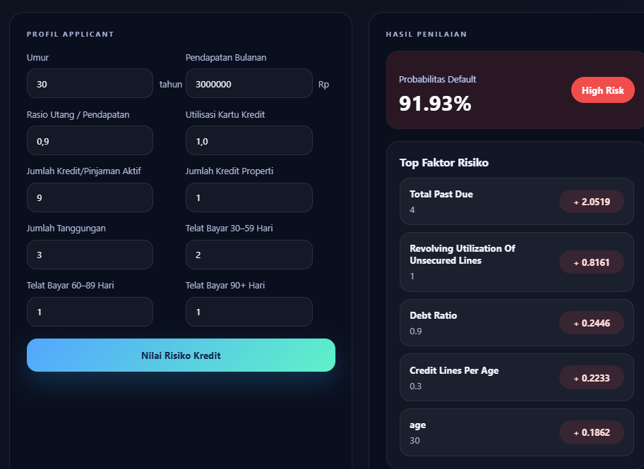

# LEDGER-90


Sistem credit risk scoring yang memprediksi probabilitas seorang nasabah mengalami
keterlambatan pembayaran 90+ hari dalam 2 tahun ke depan, dilengkapi penjelasan
**explainable AI (SHAP)** di setiap prediksi — bukan cuma angka, tapi juga alasan di baliknya.

## Demo

<!-- Ganti dengan screenshot asli kamu. Simpan di folder screenshots/ lalu update path di bawah -->
| Low Risk | Medium Risk | High Risk |
|---|---|---|
|  |  |  |

## Latar Belakang

Bank dan lembaga kredit perlu menilai risiko gagal bayar calon nasabah secara **cepat, konsisten,
dan bisa dipertanggungjawabkan** — terutama untuk nasabah yang belum punya riwayat kredit panjang.
Keputusan manual oleh credit analyst cenderung lambat dan bisa tidak konsisten antar-analis.

Selain akurasi, industri perbankan juga membutuhkan **transparansi** dalam keputusan kredit
(nasabah berhak tahu alasan pengajuannya ditolak). Karena itu, project ini tidak hanya menghasilkan
skor risiko, tapi juga penjelasan **SHAP** untuk lima faktor paling berpengaruh di setiap prediksi.


## Dataset

[Give Me Some Credit](https://www.kaggle.com/datasets/brycecf/give-me-some-credit-dataset) (Kaggle)

- 150.000 baris data profil finansial nasabah
- Target: `SeriousDlqin2yrs` (1 = telat bayar 90+ hari dalam 2 tahun, 0 = lancar)
- Imbalanced: ~6.7% kelas positif (default)

## Pipeline

1. **EDA & Data Cleaning** — deteksi & perbaikan anomali (age = 0, nilai past-due ekstrem 96/98)
2. **Feature Engineering** — `TotalPastDue`, `IncomePerDependent`, `AgeGroup`, `CreditLinesPerAge`
3. **Handle Imbalance** — SMOTE pada data training
4. **Model Comparison** — Logistic Regression, Random Forest, LightGBM
5. **Explainability** — SHAP (global feature importance + individual explanation)
6. **Threshold Calibration** — batas Low/Medium/High Risk ditentukan dari persentil distribusi
   probabilitas hasil prediksi (data-driven), bukan angka tebakan
7. **Deployment** — FastAPI (backend) + React (frontend)

## Hasil Model

| Model | AUC |
|---|---|
| **LightGBM** | **0.870** |
| Random Forest | 0.866 |
| Logistic Regression | 0.858 |

LightGBM dipilih untuk deployment karena AUC tertinggi. Selisih yang tipis antar-ketiga model
mengindikasikan sinyal dari fitur yang kuat, bukan hasil overfitting ke satu algoritma tertentu.

**Risk label threshold** (berdasarkan persentil distribusi probabilitas test set):

| Label | Rentang Probabilitas |
|---|---|
| Low Risk | < 11% |
| Medium Risk | 11% – 48% |
| High Risk | ≥ 48% |

## Struktur Proyek

```
├── app.py                          # Backend API (FastAPI)
├── credit_scoring_lgb_model.pkl    # Model LightGBM terlatih
├── requirements.txt                # Dependency Python
├── Model.ipynb                     # Notebook EDA, training, evaluasi, SHAP
├── Frontend/                       # Aplikasi React + Vite
│   ├── src/
│   └── package.json
└── SS/                    # Screenshot demo untuk README
```

## Tech Stack

**Backend:** Python, FastAPI, LightGBM, SHAP, scikit-learn, pandas
**Frontend:** React, Vite
**Modeling:** Jupyter Notebook, imbalanced-learn (SMOTE)

## Cara Menjalankan

### 1. Clone repo
```bash
git clone https://github.com/<username>/ledger-90.git
cd ledger-90
```

### 2. Jalankan backend
```bash
python app.py
```
Backend tersedia di `http://localhost:8000` (atau port yang kamu set).

### 3. Jalankan frontend
```bash
cd Frontend
npm install
npm run dev
```
Frontend tersedia di `http://localhost:5173`.

## Contoh Request `POST /predict`

```json
{
  "RevolvingUtilizationOfUnsecuredLines": 0.45,
  "age": 35,
  "NumberOfTime30_59DaysPastDueNotWorse": 1,
  "DebtRatio": 0.3,
  "MonthlyIncome": 6000000,
  "NumberOfOpenCreditLinesAndLoans": 5,
  "NumberOfTimes90DaysLate": 0,
  "NumberRealEstateLoansOrLines": 1,
  "NumberOfTime60_89DaysPastDueNotWorse": 0,
  "NumberOfDependents": 2
}
```

### Contoh Response

```json
{
  "probability_default": 0.234,
  "risk_label": "Medium Risk",
  "top_factors": [
    {
      "feature": "TotalPastDue",
      "value": 1,
      "impact": 0.42,
      "direction": "increases_risk"
    }
  ]
}
```

## Fitur

- `GET /health` — cek status server & model
- `POST /predict` — kirim profil nasabah, dapatkan probabilitas default + risk label + penjelasan SHAP
- Feature engineering otomatis di sisi API (konsisten dengan proses training)
- Frontend interaktif dengan gauge visual dan breakdown faktor risiko

## Keterbatasan & Next Steps

- Prototype/proof-of-concept, belum melalui uji fairness/bias (misal potensi bias terhadap usia/gender)
- Hanya menggunakan satu tabel data; belum menggabungkan riwayat dari credit bureau eksternal
- Belum ada model monitoring untuk mendeteksi data drift dari waktu ke waktu
- Rencana pengembangan: hyperparameter tuning, endpoint batch prediction, integrasi laporan
  otomatis berbasis LLM untuk narasi hasil analisis risiko

## Tips Debug

- Error `unexpected token` di browser biasanya karena backend mengembalikan HTML error page, bukan JSON — cek log server.
- Error `Failed to fetch` — pastikan backend berjalan dan URL API di frontend sudah benar.
- `ModuleNotFoundError` saat load model — pastikan semua dependency di `requirements.txt` sudah terinstall di environment yang sama dengan yang dipakai saat training.

## Author

Ercent — Computer Science Student, Binus University
[LinkedIn](www.linkedin.com/in/ercent-tannius) · [Email](ercent.tannius@binus.ac.id)

---

*Project ini dibuat untuk portofolio pembelajaran credit risk modeling — bukan produk finansial resmi.*
